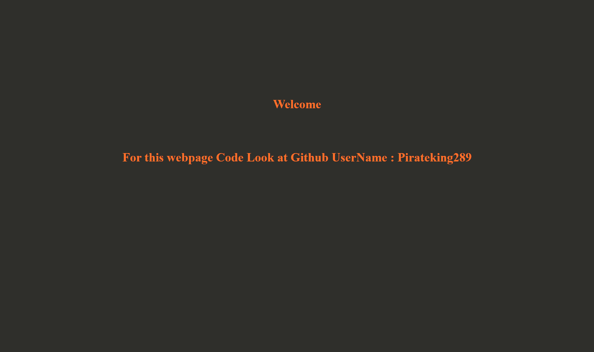

# Loading-Page
Loading page for any website.
Basically it contains a start page with your logo and two loading rotating circle in each other. After specified time periode it will redirect to welcome screen of your website.

Here is screenshots :

Loading Page Screen-Shot

First Page Screen-Shot

So look at the code use it for your webpage.

Thank You.
